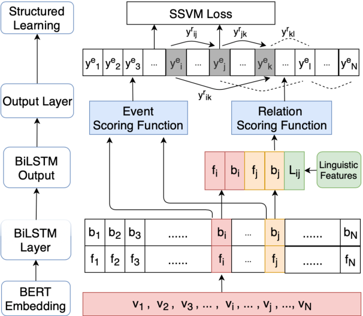

# Biomedical Event Extraction on CORD-19
<div align="center">
<a href="https://pluslabnlp.github.io/"></a>
<a href="https://www.isi.edu/"></a>
</div>


## Introduction
With the increasing concern about the COVID-19 pandemic, researchers have been putting much effort in providing useful insights into the [COVID-19 Open Research Dataset Challenge (CORD-19)](https://www.kaggle.com/allen-institute-for-ai/CORD-19-research-challenge/). This repo demonstrates how we extract biomedical events with [SciBERT](https://github.com/allenai/scibert), a BERT trained on scientific corpus, which was fine-tuned on the [GENIA BioNLP shared task 2011](http://2011.bionlp-st.org/home/genia-event-extraction-genia). We took reference from the pipeline described in [Bjorne et al.](https://pdfs.semanticscholar.org/97c9/b4ef33af9d084996c7a93c8dc520d56fc925.pdf), where the pipeline can be broken into 3 stages: trigger detection, edge/argument detection and unmerging. The extracted events can be found [here](https://drive.google.com/file/d/1FXN2QRBoFzQmLwQztUhULm8WVKxyRwu3/view?usp=sharing).

<p align="center"></p>

In addition, we adopted the framework from [Han et al.](https://www.aclweb.org/anthology/D19-1041.pdf), where trigger and edge detections are trained in a multitask setting.

<p align="center"></p>

## Dependencies

Our experiments were ran with Python 3.6.10, PyTorch 1.4.0 and CUDA 10.1 on a CentOS machine. Please follow the instructions of GPU dependencies and usage as illustrated in the official [PyTorch](https://pytorch.org/) website. We utilized the NER model `en_ner_jnlpba_md` provided by [ScispaCy](https://github.com/allenai/scispacy) for tagging biomedical entities. 

Run `pip install -r requirements` to install all the required packages. 

(Optional) If you would like to use the knowledge incorporation component, additional packages are required for [Pytorch Geometric](https://pytorch-geometric.readthedocs.io/en/latest/) can be installed as follows:
```
$ pip install torch-scatter==latest+${CUDA} -f https://pytorch-geometric.com/whl/torch-1.4.0.html
$ pip install torch-sparse==latest+${CUDA} -f https://pytorch-geometric.com/whl/torch-1.4.0.html
$ pip install torch-cluster==latest+${CUDA} -f https://pytorch-geometric.com/whl/torch-1.4.0.html
$ pip install torch-spline-conv==latest+${CUDA} -f https://pytorch-geometric.com/whl/torch-1.4.0.html
```
, where `${CUDA}` should be replaced by your installed CUDA version. (e.g. `cpu`, `cu92`, `cu101`, `cu102`)

The trained model can be downloaded from [here](https://drive.google.com/file/d/1GswpExncD4t5WAVijvh5c8Vtd4KGpH9U/view?usp=sharing). You need to unzip decompress it before running the program.


## Making predictions

### On the CORD-19 dataset

1. Run through `Preprocess CORD.ipynb` to generate the processed `.txt` files to `genia_cord_19` from the json files in the `custom_license/custom_license/pmc_json/` directory.
2. Type `. run_multitask_bert.sh` in the terminal to run the whole event extraction pipeline and generate event annotations into `genia_cord_19_output`.


### On a single biomedical sentence
Call the `biomedical_evet_extraction ` function in the `predict.py` script. This function takes in a single string as parameter. The event extraction pipeline will be run on this string.

```
>>> biomedical_evet_extraction("BMP-6 inhibits growth of mature human B cells; induction of Smad phosphorylation and upregulation of Id1.")
>>> [{'tokens': ['BMP-6', 'inhibits', 'growth', 'of', 'mature', 'human', 'B', 'cells', ';', 'induction', 'of', 'Smad', 'phosphorylation', 'and', 'upregulation', 'of', 'Id1', '.'], 'events': [{'event_type': 'Positive_regulation', 'triggers': [{'event_type': 'Positive_regulation', 'text': 'upregulation', 'start_token': 14, 'end_token': 14}], 'arguments': [{'role': 'Theme', 'text': 'Id1', 'start_token': 16, 'end_token': 16}]}], 'ner': [[0, 0, 'PROTEIN'], [4, 7, 'CELL_TYPE'], [11, 11, 'PROTEIN'], [16, 16, 'PROTEIN']]}]
```
## Project Structure

```
├── genia_cord_19
├── genia_cord_19_output
├── preprocessed_data
├── eval
└── weights

```


## Performance
Currently, this repo contains only the fine-tuned SciBERT on the GENIA dataset, whose performance is on par with the previous SOTA result. The best performing model with knowledge incorporation from [UMLS](https://www.nlm.nih.gov/research/umls/index.html), a large biomedical knowledge grapah, using GNN will soon be released.
| Model        | Dev Set F1           | Test Set F1  |
| ------------- |-------------:| -----:|
|   SciBERT Baseline    | 59.33      |   58.50  |
| [Previous SOTA](https://www.aclweb.org/anthology/N19-1145.pdf) | N/A      |   58.65  |